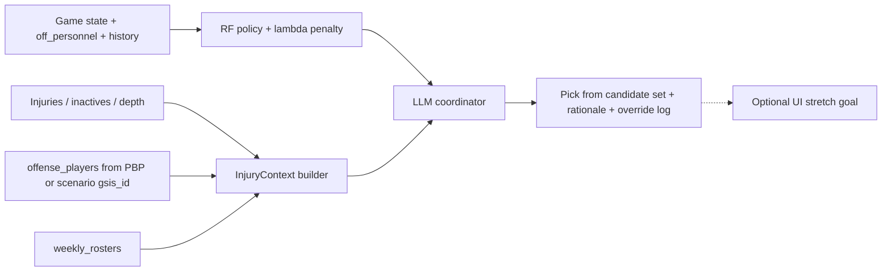

# CS 153 Project Plan: NFL Defensive Playcaller Assistant

## Project Objective

Build an assistant that recommends a defensive call for a given game situation by combining:

- A **quantitative policy layer** trained on historical play data: choose a defensive configuration that **minimizes estimated offensive EPA** (not imitate what teams have done in the past)
- A **qualitative synthesis layer** that adjusts the recommendation using who is actually on offense
- **Interactive demo UI** as an optional **stretch goal** (not required for core completion)

For this phase, the assistant only addresses **3rd/4th down snaps where the offense is actively trying to convert**. The primary optimization target is **low offensive EPA**; conversion prevention remains a key **evaluation** metric alongside EPA.

**v0 (current implementation):** Tabular game state includes **timeouts remaining** for each team (`posteam_timeouts_remaining`, `defteam_timeouts_remaining`) and an explicit **`defense_is_home`** indicator (derived from `defteam` vs. `home_team`). **Weather** features (e.g. temperature, wind, precipitation, indoor/outdoor) are **not yet** included — wire these from play-by-play plus a schedule/weather join in a later version. Weather shapes pass/rush tradeoffs and remains a post-v0 gap.

## Scope Adjustment for 8 Weeks

To stay feasible, this plan narrows your original vision:

- Use **both the 2024 and 2025 regular seasons**; rows missing defensive coverage labels (`defense_man_zone_type`, `defense_coverage_type`) are dropped at ingestion.
- Focus on **3rd and 4th down conversion attempts only** (high leverage situations).
- Exclude non-conversion intent plays:
  - All special teams contexts (`punt`, `field_goal`, fake special teams, etc.)
  - QB kneeldowns
  - QB spikes / clock-stops
  - Plays that end in **offsetting fouls** (excluded from modeling rows)
  - Plays that end in **procedure-based defensive penalties** (e.g. encroachment, neutral zone infraction, defensive delay — exclude per project filter rules)
  - Other obvious clock-management/no-attempt events identified during data QA
- Naive model prediction outputs (aligned to `nfl_data_py` / internal schema):
  - `defensive_personnel` grouping (for example `Base`, `Nickel`, `Dime`)
  - `number_of_pass_rushers`
  - `defenders_in_box`
  - `defense_coverage_type`
  - `defense_man_zone_type` — retained for display and ingestion filtering only; **excluded as a model action feature** because it is perfectly determined by `defense_coverage_type` (Cramér's V = 1.0, confirmed empirically)
- **Week 6 qualitative context** uses structured **injury / inactive / roster** data from `nfl_data_py` (not scouting RAG). Optional **Chroma + RAG** remains a stretch goal only if a text corpus is added later.

## Penalties (focal types for labels and QA)

The full modeling set remains **all** filtered 3rd/4th conversion-attempt plays that pass the exclusions above (not “penalty-only” rows). For **documentation, filter QA, and label semantics**, this project calls out three penalty families where **down / possession state** and **EPA** usually move in an interpretable way and often reflect **how the play might have gone** without the flag (still observational, not counterfactual truth):

1. **Defensive pass interference** — spot foul and **automatic first down**; tightly tied to downfield passing outcome.
2. **Defensive holding** — can extend drives or negate a defensive “win” on the play via an **automatic first down**; enforcement varies by situation but is still a useful **defensive mistake** signal.
3. **Intentional grounding** — **offensive** penalty (**loss of down** / spot foul); included because it sharply changes the down series and reflects **QB under pressure** outcomes when accepted, even though it is not a defensive penalty.

**Rationale:** These three are enough for a first pass without trying to encode every penalty type. **Conversion** and **EPA** on each row should follow `**nfl_data_py` / nflfastR post-enforcement fields (`epa`, `first_down`, `down`/`ydstogo` after the play, etc.); spot-check rows for each focal type during filter QA.

**Optional additions later** (if edge-case volume or label noise warrants): **defensive illegal contact** (often auto first in NFL), **defensive personal foul / unnecessary roughness** when it **awards a first down** (similar “free series” effect to DPI). **Not required** for v1.

## Policy vs imitation (how this project is framed)

- **Policy-style recommendation:** From game state, offense personnel, and **recent in-game 3rd/4th conversion-attempt history** (see below), **enumerate a finite set of candidate defensive configurations** (derived from historical data: observed tuples or grouped buckets). For each candidate, estimate **expected offensive EPA** (and optionally conversion probability) using models trained on observational plays. **Select a candidate using a composite objective:** primarily **minimum estimated EPA**, with an optional **predictability penalty** when repetition is not clearly superior (see Unpredictability and EPA tradeoffs).
- **Not the goal:** Behavior cloning / “predict what NFL defenses usually call” as the final recommendation. Baselines may use frequency for comparison, but the **deliverable recommendation** is driven by **estimated EPA** (plus the explicit predictability term), not by copying past play calls.

## In-game prior-down history (coordinator memory)

Defensive play callers use **what they have already shown** on earlier high-leverage downs in the same game. To approximate that without full sequence modeling:

- **Window:** For each decision, build features from the **most recent five prior snaps in that game** that match this project’s filter (**3rd/4th down conversion attempts**, defense on field) — i.e. the last five such plays **before** the current one. Do **not** include the current play; cap at five for recency and scope. (Colloquially “third-down history”; fourth downs count the same way.)
- **Tabular features (policy / RF layer):** e.g. lagged buckets for personnel / coverage / rush count, counts of repeats, “same scheme as previous conversion down,” and position in the sequence (1st, 2nd, … such situation for this defense in the game). These feed the **outcome models** so estimated EPA can depend on **state + candidate action + recent defensive choices** when the data support it.
- **Cold start:** Early in the game, history features are empty or partial; the model learns a default.

## Unpredictability and EPA tradeoffs

**Pure EPA minimization** and **unpredictability** can diverge: repeating a call might still look best by the numbers. This project handles that explicitly:

- **Primary:** Minimize **estimated offensive EPA** for the chosen configuration.
- **Predictability penalty (conditional):** When scoring each candidate, add a small term that **penalizes repeating** a defensive scheme (or key buckets) **only when** the model does **not** assign a strong EPA advantage to repeating — for example, when the best few candidates are **within a narrow EPA band** and repeating would match a recent call, nudge toward a diversified option. If repeating is **clearly** better by estimated EPA, the penalty should not override that (tunable λ in implementation).
- **LLM layer:** Surfaces **explicit** unpredictability reasoning for the report and user (“we have shown X on the last two third downs; consider varying Y”) and can **tie-break** or adjust when the tabular layer is flat — complementary to numeric history features, not a replacement for them.

## Observational limitation (important)

Play-by-play data is **not a randomized experiment**. Defensive calls are chosen by coaches based on information we do not always observe (injuries, film, tendencies). So **estimated EPA conditional on (state, defensive action)** reflects **associations in historical data**, not guaranteed causal optimality. The qualitative layer exists partly to inject **player- and context-specific** reasoning that pure tabular models miss. Name this limitation in the final report.

**Predictability proxy:** The conditional repeat penalty only discourages **same-game** repetition the data can see; it does **not** model offensive **beliefs** (e.g., a rare blitz being more valuable when the offense expects zone), so it cannot claim full causal “surprise value.” Among **near-ties** in estimated EPA it is a conservative **linear** tilt toward less-repeated schemes—not a separate mathematical “reward for unpredictability,” nor an optimal mixed-strategy calling rule. **Name this** in the final report next to the observational limitation.

## System Architecture (MVP)

Solid arrows: core path. Dotted: optional when time allows.

**Layer responsibilities:**

- **RF policy (frozen in Week 6):** Scores the finite candidate set from state, `off_personnel`, and in-game history. **Does not** ingest individual player skill or injury flags — that separation is intentional (observational policy vs. game-day context).
- **InjuryContext builder:** Joins `nfl_data_py` injury reports, gameday inactives, weekly rosters, and depth charts to PBP via `**gsis_id`** (`offense_players` on each snap, aligned with `offense_names` / `offense_positions`); emits structured JSON (out / questionable / on-field / material absences).
- **LLM coordinator:** Consumes top‑k RF candidates, history narrative, unpredictability signals, and `InjuryContext`. May **affirm** or **re-rank among the same candidates** when personnel reality diverges from what the tabular layer assumes. Output is constrained to the candidate set; overrides are logged.

## Eight-Week Timeline

### Weeks 1-2: Data Ingestion and Schema Lock

- Implement ingestion script with `nfl_data_py` for **2024 and 2025** regular season plays.
- Apply strict filtering for valid decision points:
  - Keep `down in {3,4}`
  - Keep only plays where offense is on field and attempting to convert
  - Remove special teams, kneels, spikes, offsetting fouls, procedure-based defensive penalties, and other no-attempt rows per project rules
  - Ensure **EPA and conversion labels** match `**nfl_data_py` post-enforcement** state on every retained row; use **Penalties (focal types) for QA spot-checks (DPI, defensive holding, intentional grounding)
- Filter and persist relevant columns using **consistent feature names** (see Scope):
  - Game-state/context: `down`, `ydstogo`, `yardline_100`, `score_differential`, `game_seconds_remaining`, `posteam_timeouts_remaining`, `defteam_timeouts_remaining`, `defense_is_home` (derived from `defteam` vs. `home_team`) — post-v0: **weather** covariates where available
  - Offensive descriptors: `offense_personnel`, formation/motion fields (if available)
  - Defensive descriptors: defensive personnel grouping field, `number_of_pass_rushers`, `defenders_in_box`, `defense_man_zone_type`, `defense_coverage_type`
  - Snap-level players (semicolon-delimited lists; GSIS IDs aligned by index with names/positions):
    - **Offense:** `offense_players`, `offense_names`, `offense_positions`
    - **Defense:** `defense_players`, `defense_names`, `defense_positions`
  - Targets/outcomes: `epa`, conversion success label, play result flags, penalty flags for filter logic
- Drop rows missing `defense_man_zone_type` or `defense_coverage_type` at ingestion; track missingness for all other defensive-detail fields.
- **Snap-level player fields** are persisted in the Week 2 artifact (not RF inputs in v0):
  - **Offense** — used in Week 6: `offense_players` (GSIS join key), `offense_names`, `offense_positions` for `InjuryContext` and LLM narrative on `posteam`.
  - **Defense** — persisted for a **future** qualitative layer on `defteam` (injury/inactive context, matchup reasoning); same join pattern as offense; **not** consumed by the RF or Week 6 offense-focused coordinator.
  - Document null rates and list-length alignment (`len(players) == len(names) == len(positions)`) in ingestion QA; normalize `gsis_id` strings when joining injury/roster tables (Week 6+).
- **Per-game ordering:** Sort plays so each row can be joined to **prior 3rd/4th conversion-attempt history on defense** in that game (for training and evaluation, compute the rolling “last five such plays” window without leaking future plays).
- Define canonical internal schema and save to CSV snapshots.
- Deliverable: reproducible data pull + cleaned dataset artifact.

### Week 3: Feature Engineering

- Engineer baseline features (situation + offense personnel + context bins).
- Add **in-game history features** from the **five most recent prior 3rd/4th conversion attempts on defense** in the same game (lags, repeat flags, coverage/personnel buckets — see In-game prior-down history).
- Define modeling subsets:
  - `core_set`: all filtered plays with required baseline features
  - `rich_set`: subset with complete defensive-detail labels (`number_of_pass_rushers`, `defenders_in_box`, `defense_coverage_type`, plus defensive personnel grouping); `defense_man_zone_type` is present in the dataset but excluded from model action features (see Scope)
- Deliverable: feature table (RF inputs unchanged; snap-level player columns already in Week 2 schema — not used as tabular model features in v1).

### Weeks 4-5: Quantitative Policy Engine

- Implement **candidate defensive actions**: finite set from observed tuples in `rich_set` (or grouped buckets) so inference scores **explicit candidates**, not an unbounded space.
- **Objective:** **Minimize estimated offensive EPA** given state, offense personnel, **and third-down history features**, then apply the **conditional predictability penalty** when repeating is not clearly best by EPA (see Unpredictability and EPA tradeoffs).
- **Architecture:** **single RF regressor** over concatenated `[state features, action components]` inputs. Each training row uses the actually-called action; at inference every candidate is scored by substituting its components into the state vector. Action features are `(def_personnel, defense_coverage_type)` — `defense_man_zone_type` excluded (see Scope). In a future version, test adding **bucketed `defenders_in_box`** as an action-space refinement if sample support and calibration remain stable. Pivot to other estimators if calibration or sparsity warrant it.
- Train models that support policy scoring (e.g. EPA regression or expected EPA per candidate); use a **three-way chronological split** for evaluation:
  - **Train:** all 2024 games + 2025 weeks 1–10
  - **Validation:** 2025 weeks 11–15 (tune λ, `narrow_band`, and candidate-set pruning threshold)
  - **Test:** 2025 weeks 16+ (final holdout, touched once for reporting)
- **Baseline model (required):** at minimum a **down–distance (and field-position) bucket baseline**: e.g. predict EPA or defensive choice distribution from coarse buckets only, so the policy model must beat “ geography of the situation alone.” Optionally add team-frequency or simple logistic baselines.
- Compare policy recommendations against baselines on **EPA ranking / regret** and conversion-related metrics where applicable.
- Deliverable: model card with metrics (EPA: MAE/RMSE or ranking quality on candidates; conversion metrics where labeled), feature importance, and explicit discussion of observational limitation above.
- Document known limitations: no individual-skill awareness in the tabular layer, confounding from coordinator tendencies, reduced sample size in `rich_set`, predictability term as a repetition proxy (not opponent beliefs or mixed-strategy optimality).

### Week 6: Qualitative Layer (LLM coordinator + injury context)

**Design choice:** Use **structured injury and roster data** (not scouting RAG) to adjust RF recommendations when key offensive players are out or backups are on the field. This matches the project objective (“who is actually on offense”), avoids licensing/ops overhead, and directly addresses the observational limitation that PBP does not encode pre-snap injury knowledge.

#### Data sources (`nfl_data_py`)

| Source                                   | Role                                                                                                      |
| ---------------------------------------- | --------------------------------------------------------------------------------------------------------- |
| `import_injuries()`                      | Weekly practice/game **reports** (Out / Doubtful / Questionable) — what coordinators likely knew pre-snap |
| `import_inactives()`                     | **Gameday inactive list** — definitive “not playing” for that week                                        |
| `import_weekly_rosters()`                | `gsis_id`, position, team-week; identify active roster                                                    |
| `import_depth_charts()`                  | Starter vs backup labels (WR1, LT, etc.) keyed by `gsis_id`                                               |
| PBP `offense_players`                    | Semicolon-separated **GSIS IDs on the field** for that snap (primary join key)                            |
| PBP `offense_names`, `offense_positions` | Display names and positions, same order as `offense_players` (for LLM narrative)                          |

PBP also persists `**defense_players`**, `**defense_names**`, `**defense_positions**` (from Week 2) for a future defensive injury/personnel context module; Week 6 v1 does not read them.

Cache per-season-week snapshots alongside PBP artifacts (same reproducibility pattern as Weeks 1–2).

#### InjuryContext builder

Implement `build_injury_context(game_id, posteam, week, offense_players=None, offense_names=None)` (module: `[src/context/injury_context.py](src/context/injury_context.py)`):

1. Join injuries + inactives + roster + depth for `(season, week, posteam)` on `**gsis_id**` (all sources use nflverse GSIS IDs).
2. Parse `offense_players` (and aligned `offense_names` / `offense_positions`) into per-snap on-field lists; normalize ID strings before join.
3. Compute **expected lineup** (starters from depth chart minus out/inactive) vs **observed lineup** (`offense_players` when present).
4. Emit structured JSON, e.g.:
  - `out`, `questionable` (with `source`: `inactive` | `report`)
  - `on_field` (name, `gsis_id`, position, depth, `is_backup_for` when inferable)
  - `material_absences` — filtered by severity heuristic (QB always material; WR/TE by target share or depth rank; OL by depth chart starter flag; optional usage weights from season PBP)
5. Flag data QA mismatches (e.g. listed Out but `gsis_id` appears in `offense_players`) — exclude from LLM prompt, log for pipeline QA. Rows missing `offense_players` are excluded from replay evaluation or handled via explicit scenario `gsis_id` lists.

**Temporal modes:**

- **Historical replay (evaluation):** Prefer `offense_players` + inactives as ground truth; injury reports document what was *known* entering the game.
- **Scenario / pre-game demo:** Injury/inactive `gsis_id` lists and/or depth-chart starters; state uncertainty explicitly in the prompt when snap-level `offense_players` is absent.

#### LLM coordinator

Implement `[src/llm/coordinator.py](src/llm/coordinator.py)` — **no Chroma required for Week 6**.

**Inputs:**

- Top‑k RF candidates with predicted EPA and λ-adjusted policy scores (from Weeks 4–5 `select_action` / `score_all_candidates`)
- **Structured summary of the last five prior 3rd/4th-down defensive calls** on this defense in the game (narrative + unpredictability tie-break)
- `InjuryContext` JSON (`material_absences`, on-field vs expected deltas)
- Game state fields already in the feature row (`down`, `ydstogo`, `yardline_100`, `score_differential`, `off_personnel`, etc.)

**Behavior:**

- **Affirm** RF #1 when injuries do not materially change the offensive threat profile implied by `off_personnel`.
- **Re-rank** among the **same finite candidate set** when material absences warrant it (e.g. WR1 out → lean run-friendlier shells; backup QB → pressure/zone adjustments; starting OL out → interior rush / blitz considerations). Do **not** invent actions outside the candidate list.
- Surface unpredictability reasoning when RF candidates are within the narrow EPA band (complements λ, does not replace it).
- **Do not retrain the RF** on injury features in Week 6 — keep policy vs. qualitative separation for ablation and interpretability.

**Output schema (constrained):**

- `recommended_action` — must be one of the scored candidates (`def_personnel`, `defense_coverage_type`; `defense_man_zone_type` for display only)
- `affirmed_policy` (bool) — true if matches RF policy pick after λ
- `override` (bool) + `override_reason_codes` (e.g. `qb_out`, `wr1_out`, `ol_starter_out`, `backup_on_field`, `narrow_epa_tie`)
- `rationale` (short, 2–4 sentences, cites injury facts only from `InjuryContext` — no fabricated statuses)

**Override logging** (required for evaluation): `policy_choice`, `llm_choice`, `override`, `reason_codes`, `material_absences`, `game_id`, `play_id`.

#### Inference modes

| Mode         | Use case                                                                                                                                  |
| ------------ | ----------------------------------------------------------------------------------------------------------------------------------------- |
| **Replay**   | Real test-row: `offense_players` from PBP + cached injury/inactive context                                                                |
| **Scenario** | User specifies out/inactive `**gsis_id`** or depth-chart role (e.g. starter QB `gsis_id`) for Week 7 stress tests without a specific snap |

Wire both in the end-to-end notebook/script.

#### Week 6 deliverables

- Cached injury / inactive / roster / depth snapshots for 2024–2025
- `InjuryContext` builder (`gsis_id` joins; parse `offense_players`)
- LLM coordinator with constrained schema + override log
- End-to-end inference notebook/script: ≥3 example scenarios (include at least one **material absence** and one **affirm RF** case)
- Brief note in notebook: practice reports vs inactives vs snap-level `offense_players` — which source drives which mode

### Weeks 7-8: Evaluation and Stretch Productization

- Core: finalize evaluation scenarios and analyze policy-vs-LLM recommendation deltas.
- **Stretch goal (optional):** Streamlit or similar UI — only if core milestones are done.
- Implement 3 stress-test scenarios (use Week 6 **scenario mode** where helpful):
  - High-stakes late-game 3rd down
  - Weather-impacted game
  - QB-specific counter-planning (e.g., starter QB out / backup in — via `InjuryContext` + scenario overrides)
- Deliverable: final report with reproducible scenario walkthroughs; demo/video/UI optional.

## Core Deliverables

- Data pipeline script: `[scripts/pull_pbp_data.py](scripts/pull_pbp_data.py)`
- Cleaning/feature module: `[src/features/build_features.py](src/features/build_features.py)` (includes parsing/normalization of snap-level `offense_`* and `defense_*` player fields from Week 2 schema)
- Model training pipeline: `[src/model/train_rf.py](src/model/train_rf.py)` (or renamed if architecture pivots)
- Injury/roster context module: `[src/context/injury_context.py](src/context/injury_context.py)` (`build_injury_context`, cached `nfl_data_py` pulls)
- Coordinator prompt logic: `[src/llm/coordinator.py](src/llm/coordinator.py)` (constrained output, override logging)
- Optional RAG indexing/query module: `[src/rag/index_and_retrieve.py](src/rag/index_and_retrieve.py)` (**stretch only** — scouting/news corpus)
- Optional demo app (stretch): `[app/streamlit_app.py](app/streamlit_app.py)`
- Final report: `[docs/cs153_final_report.md](docs/cs153_final_report.md)`

## Evaluation Plan

- **Filter correctness:** audit sampled plays (including penalty-edge cases: offsetting excluded, procedural defensive excluded; **focal penalty rows** — DPI, defensive holding, intentional grounding — spot-checked for correct post-enforcement labels).
- **Model quality (policy layer):**
  - **EPA:** regression error and/or ranking quality for candidate defensive actions; compare to **bucket baseline**
  - **Predictability term:** sanity-check that the penalty **does not** systematically pick worse EPA when one candidate is a clear winner; compare runs with λ = 0 vs small λ
  - Conversion metrics: where useful for interpretation (not necessarily the optimization target)
- **Recommendation utility:** scenario-based expert rubric:
  - tactical plausibility
  - alignment with roster constraints
  - explanation quality
  - player-specific relevance
- **Ablation:** compare `Policy (EPA)` vs `Policy + LLM qualitative layer` on same scenarios.

### Minimal Evaluation Tracking Template

Use this table as the single source of truth while iterating.

| Category                | Metric                                                                        | Dataset / Split                                | Baseline                             | Model Variant          | Result                                                  | Target / Decision Rule                                           | Status      |
| ----------------------- | ----------------------------------------------------------------------------- | ---------------------------------------------- | ------------------------------------ | ---------------------- | ------------------------------------------------------- | ---------------------------------------------------------------- | ----------- |
| Filter QA               | % sampled rows that satisfy scope filters                                     | Manual audit sample (`n=150`)                  | N/A                                  | Data pipeline v0       | 150/150 (100%)                                          | >= 98% valid rows                                                | Pass        |
| Filter QA               | Penalty edge-case correctness (DPI, defensive holding, intentional grounding) | All penalty plays in raw data (`n=1064` focal) | N/A                                  | Data pipeline v0       | 380/380 eligible included; 6120/6120 non-focal excluded | 100% of checked focal-penalty rows match post-enforcement labels | Pass        |
| Policy quality          | EPA MAE (lower better)                                                        | Test split (2025 wk 16+)                       | Down-distance-field bucket baseline  | Policy RF v0           | RF: 1.7180 **vs** Bucket: 1.7305                        | Beat baseline by >= 0.7%                                         | Pass        |
| Policy quality          | Candidate ranking quality (top-k hit / NDCG / pairwise accuracy)              | Test split (2025 wk 16+)                       | Bucket baseline ranking              | Policy RF v0           | **RF: 20.5% vs Bucket: 2.4% for top 3 hit rate**        | Improvement over baseline                                        | Pass        |
| Policy quality          | Regret proxy (lower better)                                                   | Test split (2025 wk 16+)                       | Bucket baseline policy               | Policy RF v0           | RF: −0.076 **vs** Bucket: −0.236 *(bucket wins)*        | Lower than baseline                                              | Fail †      |
| Predictability tradeoff | Repeat-rate on recent-history features                                        | Val split (2025 wk 11-15)                      | Lambda = 0 (42.4% repeat rate)       | Lambda = 0.033         | 7.1% **vs** 42.4% (~83% reduction)                      | Lower repeat-rate with minimal EPA loss                          | Pass        |
| Predictability tradeoff | EPA delta from lambda (lambda > 0 minus lambda = 0)                           | Val split (2025 wk 11-15)                      | Lambda = 0 (mean pred EPA = −0.0165) | Lambda = 0.033         | +0.0065 (mean pred EPA = −0.0100; ~39% less negative)   | No material degradation                                          | Pass        |
| LLM layer               | Override rate                                                                 | Scenario set + held-out sample                 | Policy-only                          | Policy + LLM v         |                                                         | Within expected band (e.g., 10-40%)                              | Pass / Fail |
| LLM layer               | Override impact on EPA proxy                                                  | Same rows as above                             | Policy-only                          | Policy + LLM           | **_ vs _**                                              | Non-negative or justified tradeoff                               | Pass / Fail |
| LLM layer               | Qualitative rubric score (1-5)                                                | Expert/scenario review (`n=`)                  | Policy-only rationale                | Policy + LLM rationale | **_ vs _**                                              | >= 4.0 average                                                   | Pass / Fail |

† **Regret proxy caveat:** The proxy rewards each recommended action by its *marginal* (global) mean EPA across all plays in the candidate set. The bucket baseline wins here because it conditions on very little — it frequently falls back to actions with the lowest global mean EPA regardless of situation. The RF conditions more carefully on state, so it recommends a contextually appropriate action that may not be the globally cheapest; the marginal-mean proxy penalises it for that. This is a limitation of the proxy, not evidence the RF is strategically worse.

#### Experiment Log Fields (fill each run)

- `run_id`:
- `train_split` (2024 all + 2025 wk 1-10) / `val_split` (2025 wk 11-15) / `test_split` (2025 wk 16+):
- `candidate_set_version`:
- `history_window` (should be 5 prior 3rd/4th attempts):
- `lambda_predictability`:
- `features_version`:
- `injury_context_version` (snapshot dates, severity heuristic version):
- `llm_coordinator_version`:
- `notes` (data issues, odd behavior, follow-up actions):

## Risk Management

- **Data messiness (personnel strings/missing fields):** cache snapshots early; freeze schema by Week 2.
- **Scope leakage in play filters:** encode explicit exclusion/inclusion rules (including penalties) and unit-test filter logic.
- **Observational / non-causal estimates:** avoid claiming causal optimality; frame as best estimate from history.
- **EPA vs unpredictability:** document λ and the “narrow EPA band” rule for the predictability penalty; tune so clear EPA winners are not discarded for variety alone.
- **Injury report vs gameday reality:** practice reports (Questionable) disagree with inactives and snap-level `offense_players`; use inactives + on-field IDs for evaluation, reports for scenario mode; document in final report.
- `**gsis_id` normalization:** coerce injury/roster/PBP IDs to one string format before joins; log rows where `offense_players` or `defense_players` is null or list lengths disagree across snap fields (`*_players`, `*_names`, `*_positions`).
- **LLM hallucination risk:** enforce constrained output schema; LLM may only cite injury facts present in `InjuryContext` JSON; log all overrides.
- **RF vs LLM separation:** do not retrain RF on injuries in Week 6; ablation requires a frozen policy layer.
- **Time compression:** prioritize policy model + evaluation; **UI is stretch only.**

## Stretch Goals (Only if Ahead)

- Interactive demo UI (Streamlit or similar).
- Expand action space (coverage shells/blitz families).
- Add simple what-if simulator for substitution changes (extends Week 6 scenario mode).
- **Defensive injury / personnel LLM layer:** mirror Week 6 `InjuryContext` for `defteam` using persisted `defense_players` + injury/inactive/roster joins (e.g. star CB or pass rusher out); extend coordinator to reason over both sides of the ball.
- Lock a retrieval corpus (scouting/news) and full **Chroma + RAG** path (not required for core Week 6).

