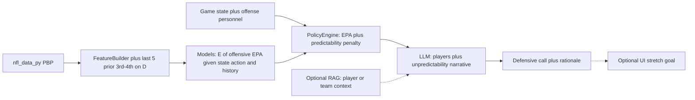

# CS 153 Project Plan: NFL Defensive Playcaller Assistant

## Project Objective

Build an assistant that recommends a defensive call for a given game situation by combining:

- A **quantitative policy layer** trained on historical play data: choose a defensive configuration that **minimizes estimated offensive EPA** (not imitate what teams have done in the past)
- A **qualitative synthesis layer** that adjusts the recommendation using who is actually on offense
- **Interactive demo UI** as an optional **stretch goal** (not required for core completion)

For this phase, the assistant only addresses **3rd/4th down snaps where the offense is actively trying to convert**. The primary optimization target is **low offensive EPA**; conversion prevention remains a key **evaluation** metric alongside EPA.

**v0 (current implementation):** Tabular game state **does not yet** include **timeouts remaining** for each team (offense and defense before the snap), an explicit **home team / home–away** indicator for the defense (or equivalent field derived from `game_id` home team vs. `defteam`), or **weather** features (e.g. temperature, wind, precipitation, indoor/outdoor). Timeouts affect clock pressure; home status can proxy crowd and sideline dynamics; weather shapes pass/rush tradeoffs. Wire these from play-by-play plus schedule (or a weather join) in a later version alongside the baseline state fields below.

## Scope Adjustment for 8 Weeks

To stay feasible, this plan narrows your original vision:

- Use **both the 2024 and 2025 regular seasons**; rows missing defensive coverage labels (`defense_man_zone_type`, `defense_coverage_type`) are dropped at ingestion.
- Focus on **3rd and 4th down conversion attempts only** (high leverage situations).
- Exclude non-conversion intent plays:
  - All special teams contexts (`punt`, `field_goal`, fake special teams, etc.)
  - QB kneeldowns
  - QB spikes / clock-stops
  - Plays that end in **offsetting fouls** (excluded from modeling rows)
  - Plays that end in **procedure-based defensive penalties** (e.g. encroachment, neutral zone infraction, defensive delay — exclude per project filter rules)
  - Other obvious clock-management/no-attempt events identified during data QA
- Naive model prediction outputs (aligned to `nfl_data_py` / internal schema):
  - `defensive_personnel` grouping (for example `Base`, `Nickel`, `Dime`)
  - `number_of_pass_rushers`
  - `defenders_in_box`
  - `defense_coverage_type`
  - `defense_man_zone_type` — retained for display and ingestion filtering only; **excluded as a model action feature** because it is perfectly determined by `defense_coverage_type` (Cramér's V = 1.0, confirmed empirically)
- Use **Chroma (local)** instead of hosted vector DB for lower ops overhead **if** the qualitative layer uses retrieval (see Qualitative data uncertainty below).

## Penalties (focal types for labels and QA)

The full modeling set remains **all** filtered 3rd/4th conversion-attempt plays that pass the exclusions above (not “penalty-only” rows). For **documentation, filter QA, and label semantics**, this project calls out three penalty families where **down / possession state** and **EPA** usually move in an interpretable way and often reflect **how the play might have gone** without the flag (still observational, not counterfactual truth):

1. **Defensive pass interference** — spot foul and **automatic first down**; tightly tied to downfield passing outcome.
2. **Defensive holding** — can extend drives or negate a defensive “win” on the play via an **automatic first down**; enforcement varies by situation but is still a useful **defensive mistake** signal.
3. **Intentional grounding** — **offensive** penalty (**loss of down** / spot foul); included because it sharply changes the down series and reflects **QB under pressure** outcomes when accepted, even though it is not a defensive penalty.

**Rationale:** These three are enough for a first pass without trying to encode every penalty type. **Conversion** and **EPA** on each row should follow `**nfl_data_py` / nflfastR post-enforcement** fields (`epa`, `first_down`, `down`/`ydstogo` after the play, etc.); spot-check rows for each focal type during filter QA.

**Optional additions later** (if edge-case volume or label noise warrants): **defensive illegal contact** (often auto first in NFL), **defensive personal foul / unnecessary roughness** when it **awards a first down** (similar “free series” effect to DPI). **Not required** for v1.

## Policy vs imitation (how this project is framed)

- **Policy-style recommendation:** From game state, offense personnel, and **recent in-game 3rd/4th conversion-attempt history** (see below), **enumerate a finite set of candidate defensive configurations** (derived from historical data: observed tuples or grouped buckets). For each candidate, estimate **expected offensive EPA** (and optionally conversion probability) using models trained on observational plays. **Select a candidate using a composite objective:** primarily **minimum estimated EPA**, with an optional **predictability penalty** when repetition is not clearly superior (see Unpredictability and EPA tradeoffs).
- **Not the goal:** Behavior cloning / “predict what NFL defenses usually call” as the final recommendation. Baselines may use frequency for comparison, but the **deliverable recommendation** is driven by **estimated EPA** (plus the explicit predictability term), not by copying past play calls.

## In-game prior-down history (coordinator memory)

Defensive play callers use **what they have already shown** on earlier high-leverage downs in the same game. To approximate that without full sequence modeling:

- **Window:** For each decision, build features from the **most recent five prior snaps in that game** that match this project’s filter (**3rd/4th down conversion attempts**, defense on field) — i.e. the last five such plays **before** the current one. Do **not** include the current play; cap at five for recency and scope. (Colloquially “third-down history”; fourth downs count the same way.)
- **Tabular features (policy / RF layer):** e.g. lagged buckets for personnel / coverage / rush count, counts of repeats, “same scheme as previous conversion down,” and position in the sequence (1st, 2nd, … such situation for this defense in the game). These feed the **outcome models** so estimated EPA can depend on **state + candidate action + recent defensive choices** when the data support it.
- **Cold start:** Early in the game, history features are empty or partial; the model learns a default.

## Unpredictability and EPA tradeoffs

**Pure EPA minimization** and **unpredictability** can diverge: repeating a call might still look best by the numbers. This project handles that explicitly:

- **Primary:** Minimize **estimated offensive EPA** for the chosen configuration.
- **Predictability penalty (conditional):** When scoring each candidate, add a small term that **penalizes repeating** a defensive scheme (or key buckets) **only when** the model does **not** assign a strong EPA advantage to repeating — for example, when the best few candidates are **within a narrow EPA band** and repeating would match a recent call, nudge toward a diversified option. If repeating is **clearly** better by estimated EPA, the penalty should not override that (tunable λ in implementation).
- **LLM layer:** Surfaces **explicit** unpredictability reasoning for the report and user (“we have shown X on the last two third downs; consider varying Y”) and can **tie-break** or adjust when the tabular layer is flat — complementary to numeric history features, not a replacement for them.

## Observational limitation (important)

Play-by-play data is **not a randomized experiment**. Defensive calls are chosen by coaches based on information we do not always observe (injuries, film, tendencies). So **estimated EPA conditional on (state, defensive action)** reflects **associations in historical data**, not guaranteed causal optimality. The qualitative layer exists partly to inject **player- and context-specific** reasoning that pure tabular models miss. Name this limitation in the final report.

**Predictability proxy:** The conditional repeat penalty only discourages **same-game** repetition the data can see; it does **not** model offensive **beliefs** (e.g., a rare blitz being more valuable when the offense expects zone), so it cannot claim full causal “surprise value.” Among **near-ties** in estimated EPA it is a conservative **linear** tilt toward less-repeated schemes—not a separate mathematical “reward for unpredictability,” nor an optimal mixed-strategy calling rule. **Name this** in the final report next to the observational limitation.

## System Architecture (MVP)

Solid arrows: core path. Dotted: optional when data or time allow.

## Eight-Week Timeline

### Weeks 1-2: Data Ingestion and Schema Lock

- Implement ingestion script with `nfl_data_py` for **2024 and 2025** regular season plays.
- Apply strict filtering for valid decision points:
  - Keep `down in {3,4}`
  - Keep only plays where offense is on field and attempting to convert
  - Remove special teams, kneels, spikes, offsetting fouls, procedure-based defensive penalties, and other no-attempt rows per project rules
  - Ensure **EPA and conversion labels** match `**nfl_data_py` post-enforcement** state on every retained row; use **Penalties (focal types)** for QA spot-checks (DPI, defensive holding, intentional grounding)
- Filter and persist relevant columns using **consistent feature names** (see Scope):
  - Game-state/context: `down`, `ydstogo`, `yardline_100`, `score_differential`, `game_seconds_remaining` — post-v0: per-team **timeouts** remaining, **home team** (or `defense_is_home`), and **weather** covariates where available
  - Offensive descriptors: `offense_personnel`, formation/motion fields (if available)
  - Defensive descriptors: defensive personnel grouping field, `number_of_pass_rushers`, `defenders_in_box`, `defense_man_zone_type`, `defense_coverage_type`
  - Targets/outcomes: `epa`, conversion success label, play result flags, penalty flags for filter logic
- Drop rows missing `defense_man_zone_type` or `defense_coverage_type` at ingestion; track missingness for all other defensive-detail fields.
- **Per-game ordering:** Sort plays so each row can be joined to **prior 3rd/4th conversion-attempt history on defense** in that game (for training and evaluation, compute the rolling “last five such plays” window without leaking future plays).
- Define canonical internal schema and save to CSV snapshots.
- Deliverable: reproducible data pull + cleaned dataset artifact.

### Week 3: Feature Engineering (includes RapidFuzz)

- Engineer baseline features (situation + offense personnel + context bins).
- Add **in-game history features** from the **five most recent prior 3rd/4th conversion attempts on defense** in the same game (lags, repeat flags, coverage/personnel buckets — see In-game prior-down history).
- **Bundle RapidFuzz-based name matching** with feature work: match player names from any **future** qualitative sources to `nfl_data_py` player IDs when those sources are available; maintain confidence threshold + manual override map for ambiguous matches.
- Define modeling subsets:
  - `core_set`: all filtered plays with required baseline features
  - `rich_set`: subset with complete defensive-detail labels (`number_of_pass_rushers`, `defenders_in_box`, `defense_coverage_type`, plus defensive personnel grouping); `defense_man_zone_type` is present in the dataset but excluded from model action features (see Scope)
- Deliverable: feature table; optional player mapping artifact if qualitative data is connected this week.

### Weeks 4-5: Quantitative Policy Engine

- Implement **candidate defensive actions**: finite set from observed tuples in `rich_set` (or grouped buckets) so inference scores **explicit candidates**, not an unbounded space.
- **Objective:** **Minimize estimated offensive EPA** given state, offense personnel, **and third-down history features**, then apply the **conditional predictability penalty** when repeating is not clearly best by EPA (see Unpredictability and EPA tradeoffs).
- **Architecture:** **single RF regressor** over concatenated `[state features, action components]` inputs. Each training row uses the actually-called action; at inference every candidate is scored by substituting its components into the state vector. Action features are `(def_personnel, defense_coverage_type)` — `defense_man_zone_type` excluded (see Scope). In a future version, test adding **bucketed `defenders_in_box`** as an action-space refinement if sample support and calibration remain stable. Pivot to other estimators if calibration or sparsity warrant it.
- Train models that support policy scoring (e.g. EPA regression or expected EPA per candidate); use a **three-way chronological split** for evaluation:
  - **Train:** all 2024 games + 2025 weeks 1–10
  - **Validation:** 2025 weeks 11–15 (tune λ, `narrow_band`, and candidate-set pruning threshold)
  - **Test:** 2025 weeks 16+ (final holdout, touched once for reporting)
- **Baseline model (required):** at minimum a **down–distance (and field-position) bucket baseline**: e.g. predict EPA or defensive choice distribution from coarse buckets only, so the policy model must beat “ geography of the situation alone.” Optionally add team-frequency or simple logistic baselines.
- Compare policy recommendations against baselines on **EPA ranking / regret** and conversion-related metrics where applicable.
- Deliverable: model card with metrics (EPA: MAE/RMSE or ranking quality on candidates; conversion metrics where labeled), feature importance, and explicit discussion of observational limitation above.
- Document known limitations: no individual-skill awareness in the tabular layer, confounding from coordinator tendencies, reduced sample size in `rich_set`, predictability term as a repetition proxy (not opponent beliefs or mixed-strategy optimality).

### Week 6: Qualitative Layer (LLM coordinator; RAG if data available)

- **Qualitative data uncertainty:** Best-case retrieval uses scouting snippets, news, and injury summaries. **Sources are not locked yet** — options include: structured stats-only blurbs, **user-provided** text, licensed excerpts, or public-domain summaries. Until a source is chosen, implement the **LLM coordinator** to consume **structured model outputs + identified offensive players**; add **Chroma + RAG** when a corpus exists.
- Coordinator prompt consumes:
  - Policy recommendation (EPA + predictability penalty) + uncertainty signals if available
  - **Structured summary of the last five prior 3rd/4th-down defensive calls in this game** (for narrative and tie-breaking)
  - Identified offensive players on field (initially offense only)
  - Retrieved context **when available** (skill profiles, usage, injuries)
  - Rule constraints on valid output fields
- Output structured recommendation with short rationale and any targeted adjustments from the policy output.
- Explicitly record when the LLM overrides the policy layer and why (traceability for evaluation).
- Deliverable: end-to-end inference notebook/script with example scenarios.

### Weeks 7-8: Evaluation and Stretch Productization

- Core: finalize evaluation scenarios and analyze policy-vs-LLM recommendation deltas.
- **Stretch goal (optional):** Streamlit or similar UI — only if core milestones are done.
- Implement 3 stress-test scenarios:
  - High-stakes late-game 3rd down
  - Weather-impacted game
  - QB-specific counter-planning (e.g., mobile QB vs pocket backup)
- Deliverable: final report with reproducible scenario walkthroughs; demo/video/UI optional.

## Core Deliverables

- Data pipeline script: `[scripts/pull_pbp_data.py](scripts/pull_pbp_data.py)`
- Cleaning/feature module: `[src/features/build_features.py](src/features/build_features.py)` (includes RapidFuzz matching helpers or imports `[src/data/player_matcher.py](src/data/player_matcher.py)`)
- Model training pipeline: `[src/model/train_rf.py](src/model/train_rf.py)` (or renamed if architecture pivots)
- Optional RAG indexing/query module: `[src/rag/index_and_retrieve.py](src/rag/index_and_retrieve.py)` (when corpus exists)
- Coordinator prompt logic: `[src/llm/coordinator.py](src/llm/coordinator.py)`
- Optional demo app (stretch): `[app/streamlit_app.py](app/streamlit_app.py)`
- Final report: `[docs/cs153_final_report.md](docs/cs153_final_report.md)`

## Evaluation Plan

- **Filter correctness:** audit sampled plays (including penalty-edge cases: offsetting excluded, procedural defensive excluded; **focal penalty rows** — DPI, defensive holding, intentional grounding — spot-checked for correct post-enforcement labels).
- **Model quality (policy layer):**
  - **EPA:** regression error and/or ranking quality for candidate defensive actions; compare to **bucket baseline**
  - **Predictability term:** sanity-check that the penalty **does not** systematically pick worse EPA when one candidate is a clear winner; compare runs with λ = 0 vs small λ
  - Conversion metrics: where useful for interpretation (not necessarily the optimization target)
- **Recommendation utility:** scenario-based expert rubric:
  - tactical plausibility
  - alignment with roster constraints
  - explanation quality
  - player-specific relevance
- **Ablation:** compare `Policy (EPA)` vs `Policy + LLM qualitative layer` on same scenarios.

### Minimal Evaluation Tracking Template

Use this table as the single source of truth while iterating.

| Category                | Metric                                                                        | Dataset / Split                                | Baseline                            | Model Variant          | Result                                                  | Target / Decision Rule                                           | Status      |
| ----------------------- | ----------------------------------------------------------------------------- | ---------------------------------------------- | ----------------------------------- | ---------------------- | ------------------------------------------------------- | ---------------------------------------------------------------- | ----------- |
| Filter QA               | % sampled rows that satisfy scope filters                                     | Manual audit sample (`n=150`)                  | N/A                                 | Data pipeline v0       | 150/150 (100%)                                          | >= 98% valid rows                                                | Pass        |
| Filter QA               | Penalty edge-case correctness (DPI, defensive holding, intentional grounding) | All penalty plays in raw data (`n=1064` focal) | N/A                                 | Data pipeline v0       | 380/380 eligible included; 6120/6120 non-focal excluded | 100% of checked focal-penalty rows match post-enforcement labels | Pass        |
| Policy quality          | EPA MAE (lower better)                                                        | Test split (2025 wk 16+)                       | Down-distance-field bucket baseline | Policy RF v0           | RF: 1.7180 **vs** Bucket: 1.7305                        | Beat baseline by >= 0.7%                                         | Pass        |
| Policy quality          | Candidate ranking quality (top-k hit / NDCG / pairwise accuracy)              | Test split (2025 wk 16+)                       | Bucket baseline ranking             | Policy RF v0           | **RF: 20.5% vs Bucket: 2.4% for top 3 hit rate**        | Improvement over baseline                                        | Pass        |
| Policy quality          | Regret proxy (lower better)                                                   | Test split (2025 wk 16+)                       | Bucket baseline policy              | Policy RF v0           | RF: −0.076 **vs** Bucket: −0.236 *(bucket wins)*        | Lower than baseline                                              | Fail †      |
| Predictability tradeoff | Repeat-rate on recent-history features                                        | Val split (2025 wk 11-15)                      | Lambda = 0 (42.4% repeat rate)      | Lambda = 0.033         | 7.1% **vs** 42.4% (~83% reduction)                     | Lower repeat-rate with minimal EPA loss                          | Pass        |
| Predictability tradeoff | EPA delta from lambda (lambda > 0 minus lambda = 0)                           | Val split (2025 wk 11-15)                      | Lambda = 0 (mean pred EPA = −0.0165) | Lambda = 0.033         | +0.0065 (mean pred EPA = −0.0100; ~39% less negative)  | No material degradation                                          | Pass        |
| LLM layer               | Override rate                                                                 | Scenario set + held-out sample                 | Policy-only                         | Policy + LLM v         |                                                         | Within expected band (e.g., 10-40%)                              | Pass / Fail |
| LLM layer               | Override impact on EPA proxy                                                  | Same rows as above                             | Policy-only                         | Policy + LLM           | **_ vs _**                                              | Non-negative or justified tradeoff                               | Pass / Fail |
| LLM layer               | Qualitative rubric score (1-5)                                                | Expert/scenario review (`n=`___)               | Policy-only rationale               | Policy + LLM rationale | **_ vs _**                                              | >= 4.0 average                                                   | Pass / Fail |

† **Regret proxy caveat:** The proxy rewards each recommended action by its *marginal* (global) mean EPA across all plays in the candidate set. The bucket baseline wins here because it conditions on very little — it frequently falls back to actions with the lowest global mean EPA regardless of situation. The RF conditions more carefully on state, so it recommends a contextually appropriate action that may not be the globally cheapest; the marginal-mean proxy penalises it for that. This is a limitation of the proxy, not evidence the RF is strategically worse.

#### Experiment Log Fields (fill each run)

- `run_id`:
- `train_split` (2024 all + 2025 wk 1-10) / `val_split` (2025 wk 11-15) / `test_split` (2025 wk 16+):
- `candidate_set_version`:
- `history_window` (should be 5 prior 3rd/4th attempts):
- `lambda_predictability`:
- `features_version`:
- `notes` (data issues, odd behavior, follow-up actions):

## Risk Management

- **Data messiness (personnel strings/missing fields):** cache snapshots early; freeze schema by Week 2.
- **Scope leakage in play filters:** encode explicit exclusion/inclusion rules (including penalties) and unit-test filter logic.
- **Observational / non-causal estimates:** avoid claiming causal optimality; frame as best estimate from history.
- **EPA vs unpredictability:** document λ and the “narrow EPA band” rule for the predictability penalty; tune so clear EPA winners are not discarded for variety alone.
- **Qualitative corpus missing:** LLM layer can run on structured outputs + player IDs first; RAG added when data exists.
- **Name matching errors:** keep manual override file and confidence logging.
- **LLM hallucination risk:** enforce constrained output schema, retrieval grounding when RAG exists, and override logging.
- **Time compression:** prioritize policy model + evaluation; **UI is stretch only.**

## Stretch Goals (Only if Ahead)

- Interactive demo UI (Streamlit or similar).
- Expand action space (coverage shells/blitz families).
- Add simple what-if simulator for substitution changes.
- Lock a retrieval corpus (scouting/news) and full RAG path.

